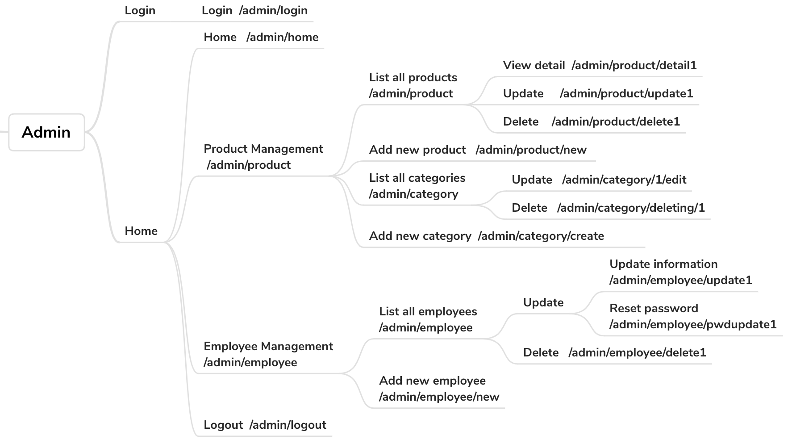
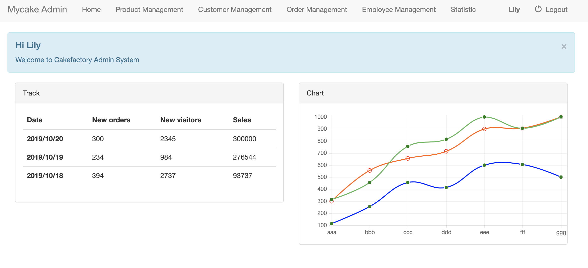
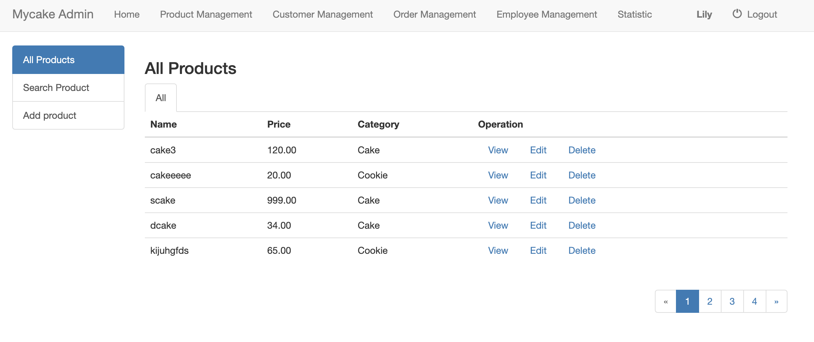
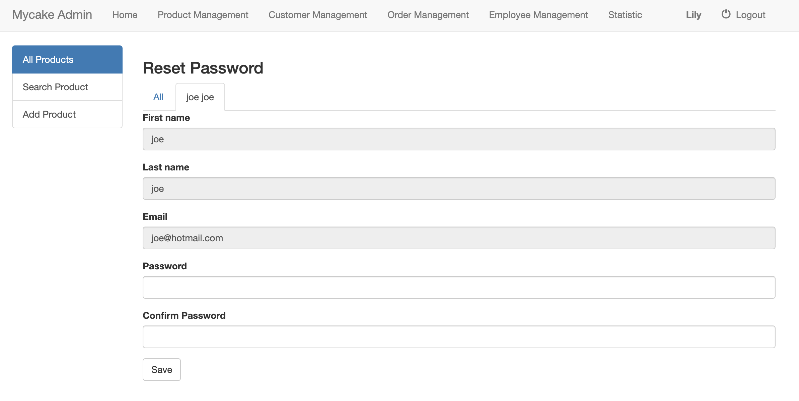

# Online Shopping Application Admin
> If you want to check the same project using pure PHP, click here: [Online-Shopping-Admin-PHP](https://github.com/maorutian/Online-Shopping-Admin-PHP)  
> This document only show Admin system Details.
> If you are interested in Online Cake Shopping Application (Customer side and Admin side), click here:

## Technical skills
PHP Laravel + Bootstrap + Datatable + Mysql
## Introduction
  This is a cake online shopping application admin side.
#### This application has the following functions:
 - Admin login/logout
 - Products
	- View available products and prices
	- Review, add, modify and delete individual product details
- Employees
	- View individual employee information
	- Review, add, modify and delete employee details
	
## Route Structure



## Files Structure
Here is a brief explanation of the folder structure (only show changed file in laravel):

```
└── app                                
│   └── Http                            
│   │   └── Controllers                 
│   │   │   └── AdminController         
│   │   └── Middleware                     
│   │       └── Authenticate.php                 
│   │       └── RedirectIfAuthenticated.php      
│   │   
│   └── Category.php          
│   └── Employee.php
│   └── Product.php
│   
└── config
│   └── auth.php
│   
└── database
│   └── migration
│   └── seeds
|   
└── public                    
│   └── css
│   └── js
|   
└── resources
│   └── views                 
│      └── admin
│      └── layout             
|
└── routes
│   └── web.php               
│
└──.env
|
└── readme_media
```

## Build

```
composer update
php artisan serve
```

## Pros of Laravel
1. Access Databases Efficiently     
2. Good Coding Standard and Security 
3. Stronger Teamwork

## Cons of Laravel
1. Limited Visibility and Control 
2. Hard to to debug                                     

## Screen Views





